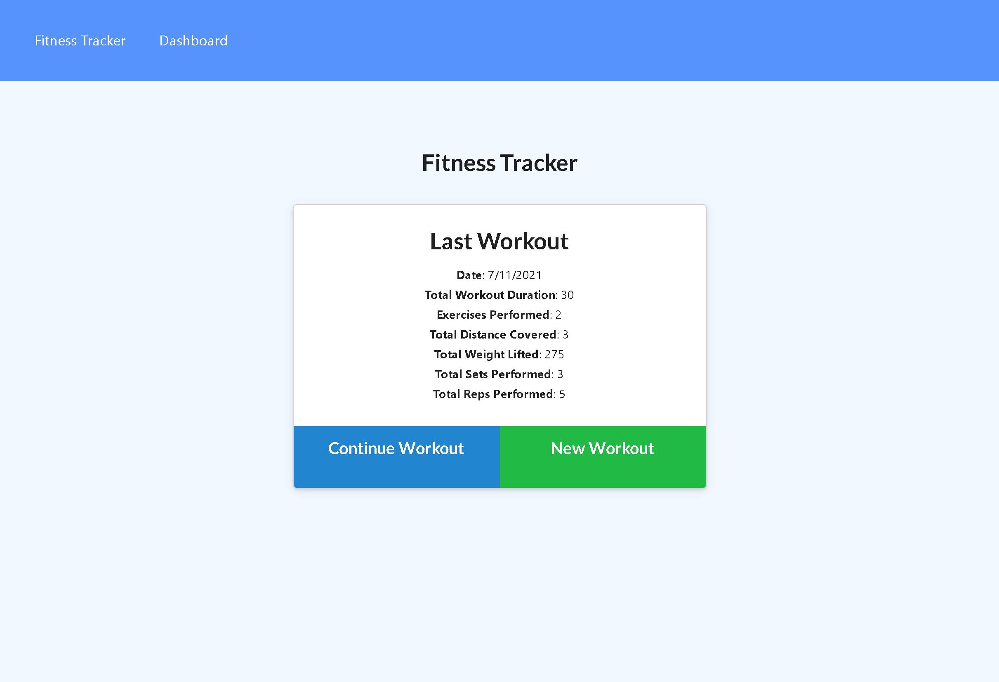
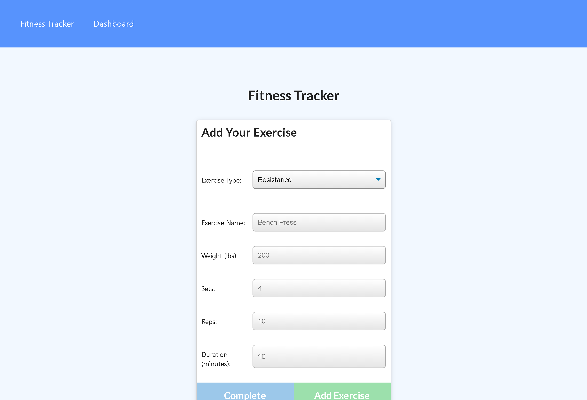
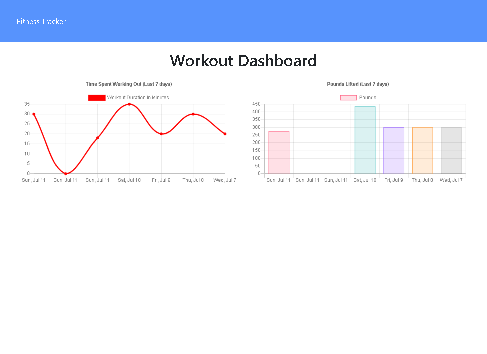

# Workout Tracker

## Contents
1. [About](#About)
2. [Description](#Description)
3. [Screen-Shots](#Screen-Shots)
4. [Contact-Info](#Contact-Info)
5. [License](#License)

## About
[Deployed Application](https://boiling-spire-57268.herokuapp.com/?id=60ece23d93c6950016d136eb)
App that helps you keep track of your work outs, both for resistance training and cardio. On launch, the home screen will display details of the most recent saved work out. The user then has the option of continuing the last saved work out or start a new work out. This will bring the user to the exercise page where they will add details for each exercise in the workout. Once the last exercise is logged, the user can select 'Complete'. This will return them to the main page. The user can also look at the Dashboard page for details of their work outs from the last seven days. It will display both weight lifted (in pounds), and total duration of each work out.

## Description
The technologies used in this app include javascript, express server, mongoDB, and mongoose. MongoDB is used to save each workout to the back end in a seperate workout collection. Mongoose is used to handle all CRUD requests to connect the front end to the back end database on the express server. 

## Screen-Shots

## Contact-Info
Alan Gaudet - <alanmgaudet@gmail.com>

Portfolio - <https://github.com/amgaudet>

## License
MIT License

Copyright (c) 2021 Alan Gaudet

Permission is hereby granted, free of charge, to any person obtaining a copy
of this software and associated documentation files (the "Software"), to deal
in the Software without restriction, including without limitation the rights
to use, copy, modify, merge, publish, distribute, sublicense, and/or sell
copies of the Software, and to permit persons to whom the Software is
furnished to do so, subject to the following conditions:

The above copyright notice and this permission notice shall be included in all
copies or substantial portions of the Software.

THE SOFTWARE IS PROVIDED "AS IS", WITHOUT WARRANTY OF ANY KIND, EXPRESS OR
IMPLIED, INCLUDING BUT NOT LIMITED TO THE WARRANTIES OF MERCHANTABILITY,
FITNESS FOR A PARTICULAR PURPOSE AND NONINFRINGEMENT. IN NO EVENT SHALL THE
AUTHORS OR COPYRIGHT HOLDERS BE LIABLE FOR ANY CLAIM, DAMAGES OR OTHER
LIABILITY, WHETHER IN AN ACTION OF CONTRACT, TORT OR OTHERWISE, ARISING FROM,
OUT OF OR IN CONNECTION WITH THE SOFTWARE OR THE USE OR OTHER DEALINGS IN THE
SOFTWARE.
